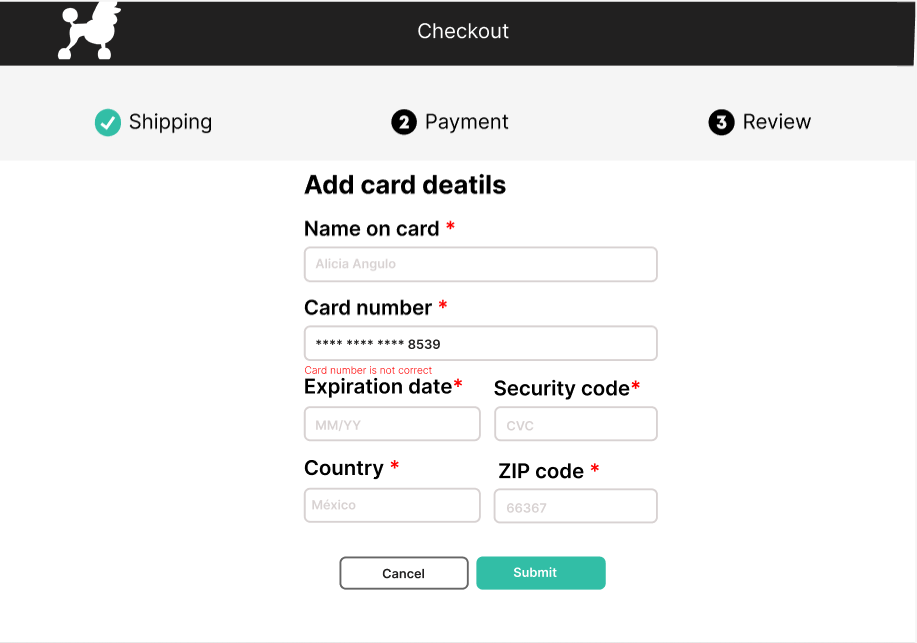

#Tarjeta de crédito válida
## 1. Resumen
El proyecto se enfoca en la ventana de pago de una tienda virtual, en la que se ingresa infomormación personal y de la tarjeta de crédito. 
Aquí se verifica si la tarjeta de crédito es valida, en caso de ser así se muestra un resumen de compra, de lo contrario aparece una alerta para llenar de nuevo los datos.

## 2. Proyecto final

## 3. Investigacion UX
La página está dirigida para el publico en general con el objetivo de comprar productos para perro en línea. En la ventana de pago se ingresan los datos de la tarjeta
y se verifica que la tarjeta sea valida, esto con la finalidad de que la compra pueda realizarse de forma correcta. Una vez realizada la verificación se realiza el pago
y se muestra la página de resumen donde se da información general de la compra.

### Prototipo a mano

### Prototipo en figma

Se propuso especificar un poco más al publico al que va dirigida la página y fue por eso que se agregó la página de resumen donde se escribe el producto que se compró, 
entendiendose que es una tienda de productos para perros.

### Prototipo final

